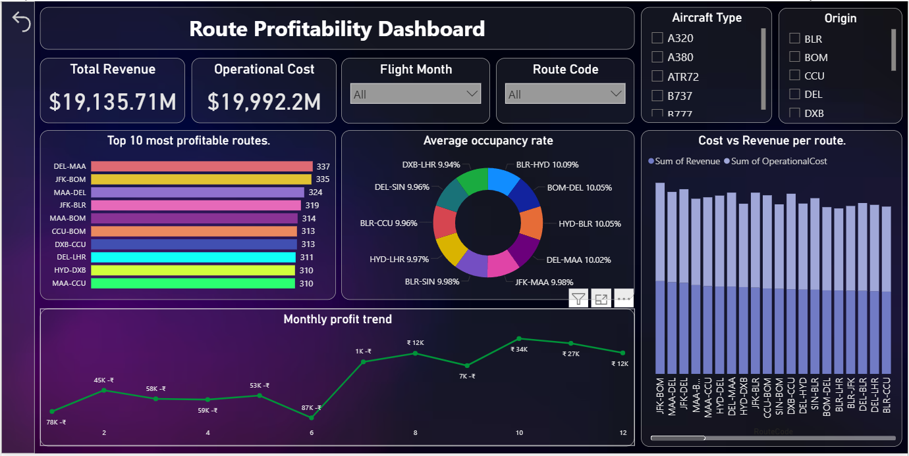

## ✈️ SkyRoutes Analysis – README

## 📸 Dashboard Preview:

## 🔍 Overview

Analyzed airline route data to evaluate operational and financial performance.

Focused on route profitability, frequency, occupancy, and seasonal trends.

## 🛠 Tools Used

SQL – Data querying and analysis

Power BI – Dashboard design

Excel – Data validation and export

PBIX File – Final dashboard output

## 📊 Key Analyses

Top 10 Frequent Routes

Avg. Revenue, Cost & Profit per Route

Underperforming Routes (Negative Profit)

Seat Occupancy % by Route

Monthly Profit Trends

Domestic vs. International Profit Comparison

Revenue per Minute Ranking

## 💡 Key Insights

High frequency ≠ High profitability

Several routes operate at a loss

Domestic routes show better avg. profits

High occupancy often correlates with profitability

Clear monthly trends suggest seasonality

Efficient routes generate more revenue per minute

## ⏱ Time Taken

Total project time: ~5.5 hours

## ✅ Conclusion

The analysis reveals valuable performance gaps and efficiency opportunities.

Routes with consistent losses should be reviewed or optimized.

Insights like revenue-per-minute and seasonal profit trends can guide strategic route planning and resource allocation.

The dashboard serves as a decision-support tool for data-driven airline operations.